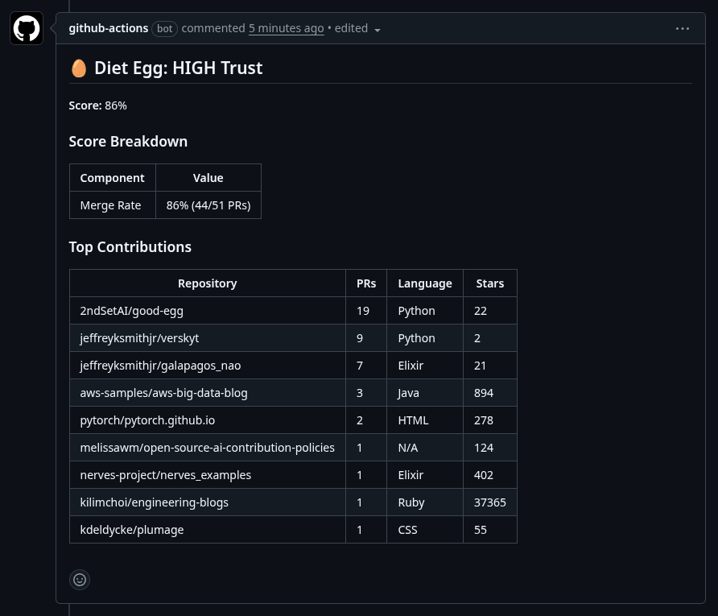

# GitHub Action Usage

Good Egg runs as a composite GitHub Action that scores the author of a pull
request and reports the trust level via PR comments, check runs, or both.

## Basic Setup

```yaml
name: Good Egg

on:
  pull_request:
    types: [opened, reopened, synchronize]

permissions:
  pull-requests: write

jobs:
  score:
    runs-on: ubuntu-latest
    steps:
      - uses: 2ndSetAI/good-egg@v0
        with:
          github-token: ${{ secrets.GITHUB_TOKEN }}
```

This posts a trust score comment on each pull request:



## Inputs

| Input | Required | Default | Description |
|-------|----------|---------|-------------|
| `github-token` | Yes | `${{ github.token }}` | GitHub token for API access |
| `config-path` | No | _(auto-detected)_ | Path to `.good-egg.yml` config file |
| `comment` | No | `true` | Post a PR comment with the trust score |
| `check-run` | No | `false` | Create a check run with the trust score |
| `fail-on-low` | No | `false` | Fail the action if trust level is LOW |
| `scoring-model` | No | `v1` | Scoring model: `v1` (Good Egg) or `v2` (Better Egg) |
| `skip-known-contributors` | No | `true` | Skip scoring for authors with merged PRs in the repo |

## Outputs

| Output | Description |
|--------|-------------|
| `score` | Normalized trust score (0.0 - 1.0) |
| `trust-level` | Trust level: HIGH, MEDIUM, LOW, UNKNOWN, BOT, or EXISTING_CONTRIBUTOR |
| `user` | GitHub username that was scored |
| `scoring-model` | Scoring model used: `v1` (Good Egg) or `v2` (Better Egg) |
| `skipped` | Whether scoring was skipped for an existing contributor (`true`/`false`) |

## Custom Configuration

To use a custom `.good-egg.yml`, check out the repository first so the
config file is available:

```yaml
jobs:
  score:
    runs-on: ubuntu-latest
    steps:
      - uses: actions/checkout@v4

      - uses: 2ndSetAI/good-egg@v0
        with:
          github-token: ${{ secrets.GITHUB_TOKEN }}
          config-path: .good-egg.yml
```

## Using Outputs in Downstream Steps

Give the step an `id` and reference its outputs:

```yaml
jobs:
  score:
    runs-on: ubuntu-latest
    steps:
      - id: egg
        uses: 2ndSetAI/good-egg@v0
        with:
          github-token: ${{ secrets.GITHUB_TOKEN }}

      - name: Print results
        run: |
          echo "Score: ${{ steps.egg.outputs.score }}"
          echo "Trust level: ${{ steps.egg.outputs.trust-level }}"
          echo "User: ${{ steps.egg.outputs.user }}"
```

## Acting on Trust Level

Use conditional steps to take different actions based on the trust level:

```yaml
jobs:
  score:
    runs-on: ubuntu-latest
    steps:
      - id: egg
        uses: 2ndSetAI/good-egg@v0
        with:
          github-token: ${{ secrets.GITHUB_TOKEN }}

      - name: Require extra review for low trust
        if: steps.egg.outputs.trust-level == 'LOW'
        run: |
          echo "::warning::Low trust PR author -- manual review required"

      - name: Auto-approve high trust
        if: >-
          steps.egg.outputs.trust-level == 'HIGH' ||
          steps.egg.outputs.trust-level == 'EXISTING_CONTRIBUTOR'
        run: |
          echo "Trusted author -- consider fast-tracking review"
```

## Strict Mode

Enable check runs and fail the build on low-trust authors:

```yaml
jobs:
  score:
    runs-on: ubuntu-latest
    steps:
      - uses: 2ndSetAI/good-egg@v0
        with:
          github-token: ${{ secrets.GITHUB_TOKEN }}
          comment: 'true'
          check-run: 'true'
          fail-on-low: 'true'
```

## Required Permissions

| Permission | Required For |
|-----------|-------------|
| `pull-requests: write` | Posting PR comments (when `comment: true`) |
| `checks: write` | Creating check runs (when `check-run: true`) |

If you only use check runs and not comments, you can omit
`pull-requests: write` and vice versa. At least one write permission is
needed for the action to report results.

## Rate Limit Considerations

Good Egg makes multiple GitHub API calls per scored user to fetch merged
PRs and repository metadata. To stay within rate limits:

- The default `GITHUB_TOKEN` provides 1000 requests per hour for Actions.
- A GitHub App installation token or personal access token provides 5000
  requests per hour.
- Reduce `fetch.max_prs` in your config to lower the number of API calls
  per user.
- The built-in cache (SQLite-backed) avoids refetching data that has not
  changed. Cache TTLs are configurable.

## Skipping Known Contributors

By default, Good Egg performs a lightweight check before the full scoring
pipeline: if the PR author already has merged PRs in the target repository,
scoring is skipped and the trust level is reported as `EXISTING_CONTRIBUTOR`.
This avoids unnecessary API calls for established contributors.

To disable this behaviour and always run full scoring:

```yaml
jobs:
  score:
    runs-on: ubuntu-latest
    steps:
      - uses: 2ndSetAI/good-egg@v0
        with:
          github-token: ${{ secrets.GITHUB_TOKEN }}
          skip-known-contributors: 'false'
```

You can check whether scoring was skipped via the `skipped` output.

## Using Better Egg (v2)

To use the v2 scoring model, set the `scoring-model` input:

```yaml
jobs:
  score:
    runs-on: ubuntu-latest
    steps:
      - uses: 2ndSetAI/good-egg@v0
        with:
          github-token: ${{ secrets.GITHUB_TOKEN }}
          scoring-model: v2
```

When using v2, PR comments are branded "Better Egg" and include a component
score breakdown showing graph score, merge rate, and account age
contributions. The `scoring-model` output reflects which model was used.

You can also set `scoring-model` via the `GOOD_EGG_SCORING_MODEL` environment
variable, but the input takes precedence.

## Example Workflows

See the [examples/](../examples/) directory for complete workflow files:

- [basic-workflow.yml](../examples/basic-workflow.yml) -- minimal setup
  that posts a PR comment
- [strict-workflow.yml](../examples/strict-workflow.yml) -- comment, check
  run, and fail-on-low
- [better-egg-workflow.yml](../examples/better-egg-workflow.yml) -- v2
  scoring model with component breakdown
