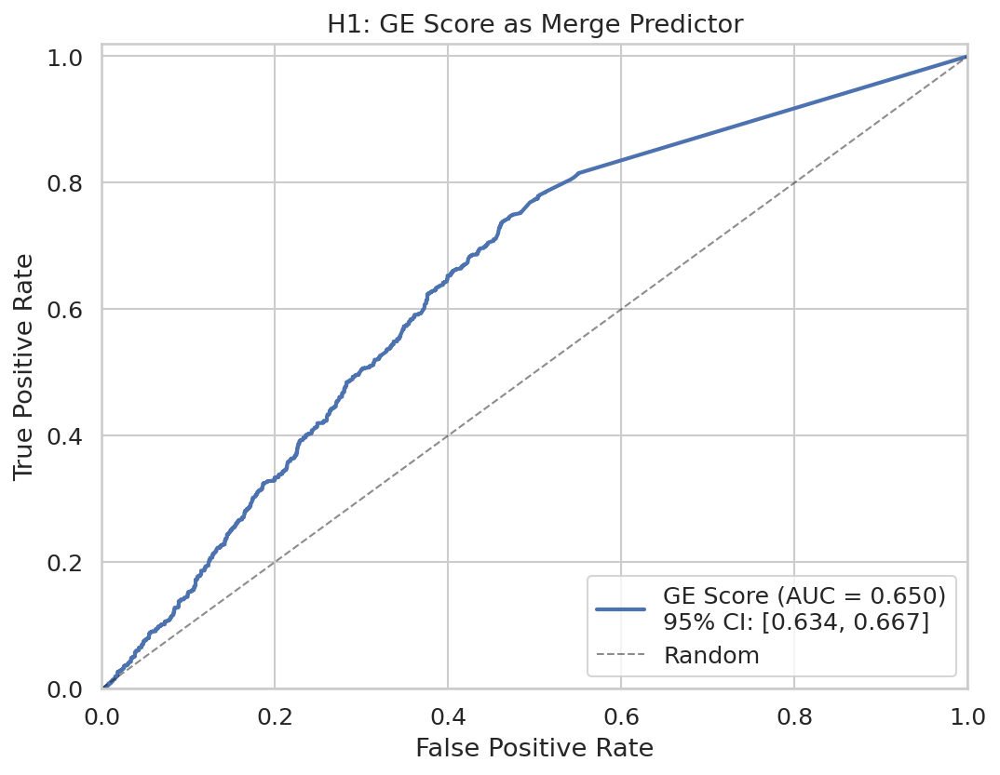
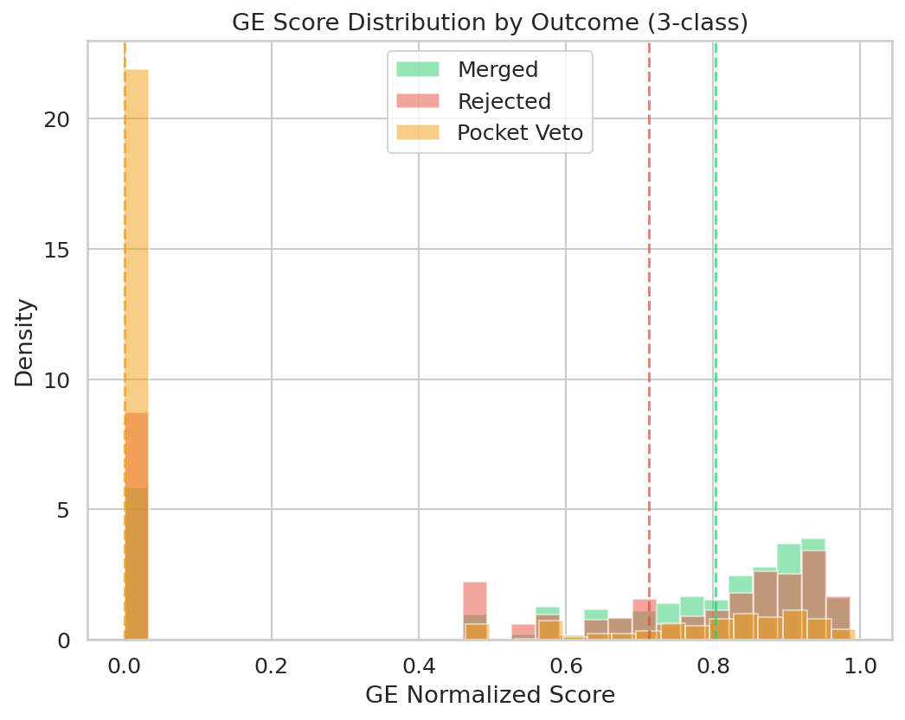
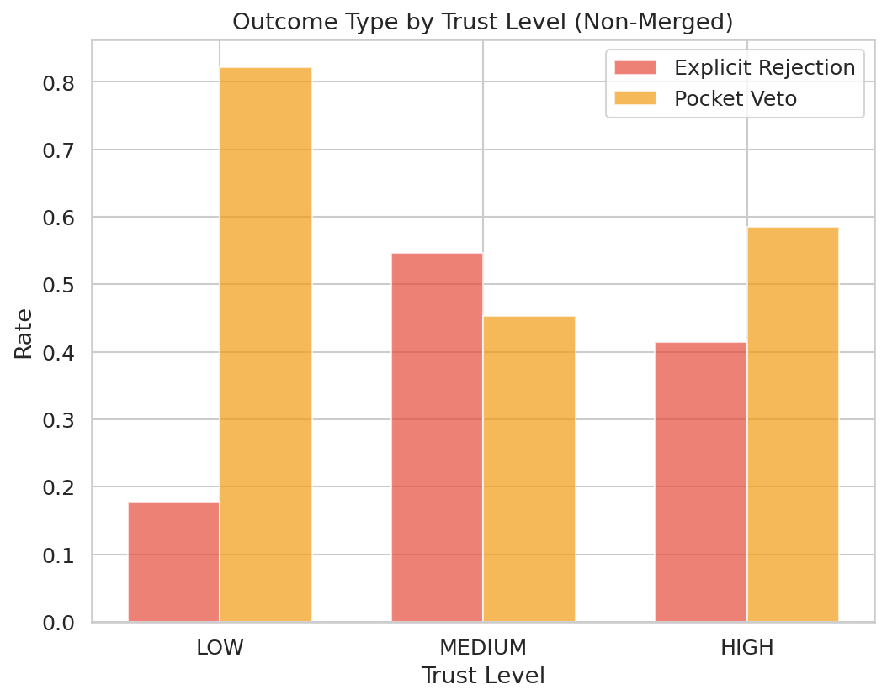
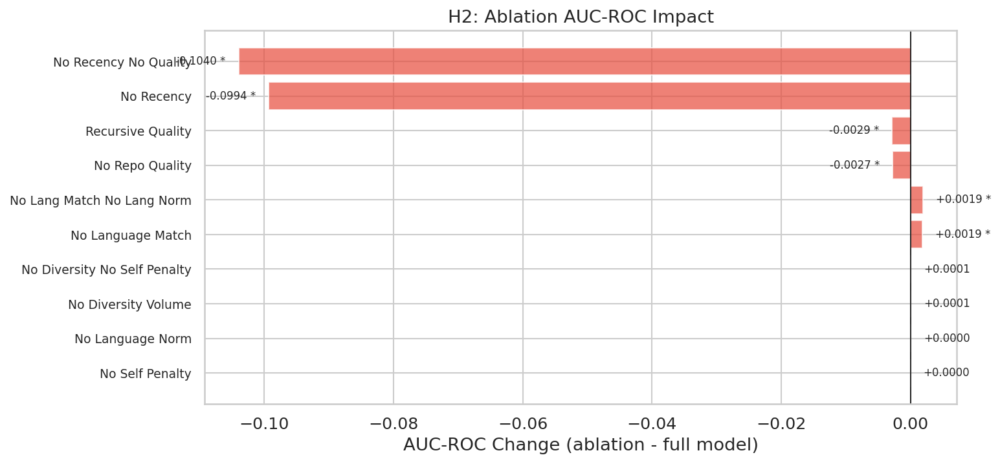
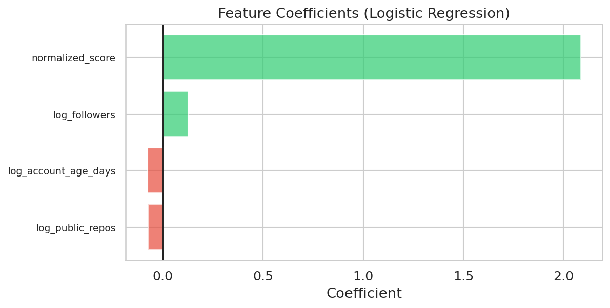
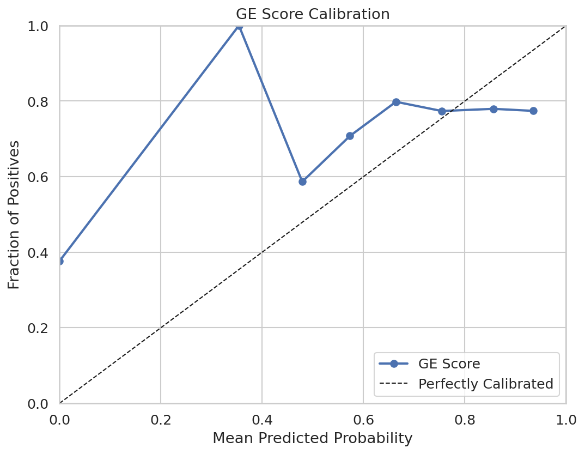

# GE Validation Study: Summary Report

**Date:** 2026-02-12 (post-audit re-run)
**Branch:** `experiments/ge-validation`
**Sample:** 4,977 PRs across 49 repositories, 12 languages
**Temporal scope:** 2024-01-01 to 2025-12-31 (four half-year bins)

---

## Overview

This study evaluates whether the Good Egg (GE) normalized trust score---a
graph-based measure of contributor reputation computed from merged PR
history---predicts PR merge outcomes on open-source repositories. The study
uses a retrospective cohort design with an anti-lookahead constraint: each
author's score is computed using only contribution data available before the
test PR was opened.

The full design is documented in [`DOE.md`](../DOE.md). This report summarizes
results from the full-scale run across 49 repositories stratified by language,
size, and domain.

A red team audit of the methodology and implementation was performed and is
documented in [`RED_TEAM_AUDIT.md`](RED_TEAM_AUDIT.md). All 13 identified
issues (3 critical, 4 major, 6 minor) have been fixed and the pipeline fully
re-run. See [Audit and Corrections](#audit-and-corrections) for details.

---

## Key Results

### H1: Binary Merge Discrimination (Primary)

**Result: Supported.** The GE score discriminates between merged and non-merged
PRs above the pre-registered threshold of AUC > 0.60.

| Metric | Value | Note |
|--------|-------|------|
| AUC-ROC | **0.671** (95% CI: 0.653--0.689) | Primary metric |
| AUC-PR | 0.807 | |
| Brier score | 0.251 | On uncalibrated scores; interpret with caution |
| Log loss | 5.065 | On uncalibrated scores; interpret with caution |

Brier score and log loss are computed on the raw GE normalized score, which is
not a calibrated probability. These values should not be compared to calibrated
baselines. AUC-ROC and AUC-PR are rank-based and unaffected by calibration.

The confidence interval [0.653, 0.689] excludes both chance (0.50) and the
pre-registered minimum threshold (0.60). Cross-validation confirms stability:
mean AUC = 0.675 +/- 0.048 across 5 folds (grouped by repository).

The binary confusion matrix at Youden's J optimal threshold (0.577) achieves
J = 0.327:

|  | Predicted Not-Merged | Predicted Merged |
|--|-----:|-----:|
| **Actual Not-Merged** | 716 | 595 |
| **Actual Merged** | 804 | 2,862 |

### H1a: Three-Class Discrimination (Merged vs. Rejected vs. Pocket Veto)

**Result: Supported.** GE scores differ significantly across all three outcome
classes.

| Test | Statistic | p-value |
|------|-----------|---------|
| Kruskal-Wallis | H = 414.6 | p < 10^-90 |
| Merged vs. Rejected (post-hoc) | U = 859,859 | p = 1.8 x 10^-6 (adjusted) |
| Merged vs. Pocket Veto (post-hoc) | U = 2,364,761 | p < 10^-89 (adjusted) |
| Rejected vs. Pocket Veto (post-hoc) | U = 239,246 | p < 10^-19 (adjusted) |

One-vs-rest AUC (how well the GE score separates each class from the other
two):

| Class | AUC-ROC | 95% CI |
|-------|---------|--------|
| Merged | 0.671 | 0.653--0.689 |
| Rejected | 0.469 | 0.440--0.499 |
| Pocket Veto | 0.292 | 0.273--0.312 |

The merged-vs-rest AUC mirrors H1. The pocket veto OVR AUC of 0.292
(equivalently, 0.708 when inverted) confirms low scores strongly predict
pocket veto outcomes. The rejected class is the hardest to separate (AUC near
0.50), consistent with rejected PRs occupying the middle of the score
distribution.

### Pocket Veto Analysis

Low-trust contributors are disproportionately pocket-vetoed rather than
explicitly rejected.

| Test | Statistic | p-value |
|------|-----------|---------|
| Chi-squared | chi2 = 118.3, df = 2 | p < 10^-25 |
| Cramer's V | 0.300 | (medium effect) |
| Cochran-Armitage trend | z = -0.246 | p = 0.805 (not significant) |

The chi-squared test confirms a significant association between trust level and
outcome type among non-merged PRs (Cramer's V = 0.300, medium effect). However,
the Cochran-Armitage trend test is not significant (p = 0.805), indicating the
relationship between trust level and pocket veto rate is not monotonically
linear --- the effect is concentrated in the LOW vs. MEDIUM/HIGH contrast
rather than a smooth gradient.

Trust-level odds ratios for merge outcome:

| Comparison | Odds Ratio | 95% CI | p-value |
|------------|-----------|--------|---------|
| HIGH vs. LOW | 4.74 | 4.10--5.47 | p < 10^-99 |
| MEDIUM vs. LOW | 3.45 | 2.80--4.26 | p < 10^-30 |
| HIGH vs. MEDIUM | 1.37 | 1.12--1.68 | p = 0.002 |

HIGH-trust authors are 4.7x more likely to have their PRs merged than
LOW-trust authors. The MEDIUM-to-LOW contrast is also strong (3.5x), while
HIGH-to-MEDIUM is smaller but still significant (1.4x).

### H2: Ablation Study

**Result: Partially supported.** Of the six scoring dimensions, only recency
decay shows a statistically significant independent contribution after
Holm-Bonferroni correction (applied to the 6 primary single-dimension
ablations per DOE Section 7.4).

| Variant | AUC | Delta | Adjusted p | Significant? |
|---------|-----|-------|-----------|:------------:|
| **Full model** | **0.671** | -- | -- | -- |
| no_recency | 0.550 | -0.121 | < 10^-68 | Yes |
| no_repo_quality | 0.669 | -0.002 | 0.117 | No |
| no_language_match | 0.672 | +0.001 | 0.342 | No |
| no_diversity_volume | 0.671 | +0.000 | 1.000 | No |
| no_language_norm | 0.671 | +0.000 | 0.812 | No |
| no_self_penalty | 0.671 | -0.000 | 0.582 | No |

Exploratory two-way interactions:

| Variant | AUC | Delta |
|---------|-----|-------|
| no_recency_no_quality | 0.546 | -0.125 |
| recursive_quality | 0.669 | -0.002 |
| no_lang_match_no_lang_norm | 0.672 | +0.001 |
| no_diversity_no_self_penalty | 0.671 | +0.000 |

Removing recency drops AUC by 0.121 (from 0.671 to 0.550), close to chance.
Repo quality shows a suggestive signal (raw p = 0.023) but does not survive
Holm-Bonferroni correction (adjusted p = 0.117). All other dimensions have
negligible individual impact.

### H3: Account Age

**Result: Supported.** Log-transformed account age significantly improves
prediction when added to the GE score (likelihood ratio test: LR = 8.64,
df = 1, p = 0.003). Account age carries modest incremental information beyond
what the GE score captures.

*Note:* The original analysis reported LR = 0.0, p = 1.0 due to
L2-regularized logistic regression suppressing the additional feature. After
fixing to unregularized models (`penalty=None`), the true signal emerged.

### H4: Embedding Similarity

**Result: Supported.** Embedding cosine similarity between PR content and
target repository content significantly improves prediction when added to
the GE score (LR = 20.82, df = 1, p = 5.1 x 10^-6).

*Note:* The original analysis reported LR = 0.0, p = 1.0 due to two
compounding issues: (1) L2 regularization suppressing the feature, and
(2) embeddings computed from repo names instead of actual content. After
fixing both issues (unregularized LRT + proper Gemini `gemini-embedding-001`
embeddings of PR bodies and repo READMEs), embedding similarity shows clear
predictive value.

### H5: Author Merge Rate

**Result: Supported.** Historical author merge rate significantly improves
prediction when added to the GE score (LR = 462.4, df = 1, p < 10^-102).
This is the strongest incremental signal of the three candidate features,
indicating that an author's overall merge track record carries substantial
information beyond the graph-based trust score.

### Feature Importance

Logistic regression coefficients (unregularized) confirm that the GE
normalized score is the dominant predictor, with author-level features (public
repos, followers, account age) contributing less but non-trivial additional
information.

### Calibration

The calibration plot shows the GE score is over-confident in the low-to-mid
range (scores 0.2--0.5 correspond to higher actual merge rates than predicted)
and slightly under-confident at high scores. The GE score should not be
interpreted as a merge probability without Platt scaling or similar calibration.

---

## Newcomer Cohort

Authors with no prior merged PRs in the GE graph ("newcomers") receive a
score of 0 and cannot be discriminated by the trust score alone.

| Cohort | n | AUC-ROC | Merge Rate |
|--------|---|---------|------------|
| Newcomer (score = 0) | 719 | 0.500 | 69.0% |
| Established (score > 0) | 4,258 | 0.689 (CI: 0.668--0.709) | 74.4% |

Newcomers constitute 14.4% of the sample. Among established contributors, the
AUC improves to 0.689, confirming the GE score is most useful for authors who
already have some contribution history. Notably, newcomers have a 69% merge
rate --- higher than the overall non-merged rate --- suggesting that many
first-time contributors to a repo already have external histories that would
produce non-zero GE scores if their other contributions were visible.

---

## Cross-Validation

Stratified group 5-fold cross-validation (grouped by target repository):

| Fold | AUC-ROC |
|------|---------|
| 1 | 0.596 |
| 2 | 0.707 |
| 3 | 0.693 |
| 4 | 0.731 |
| 5 | 0.647 |
| **Mean +/- SD** | **0.675 +/- 0.048** |

Four of five folds exceed the 0.60 threshold. Fold 1 (0.596) falls just below,
likely reflecting a repository cluster with weaker signal. The increased
variance compared to the pre-audit run (SD 0.048 vs. 0.027) is expected given
the larger, more diverse sample that now includes still-open PRs and
fast-merged PRs.

---

## Implications for Good Egg

1. **The GE score is a meaningful merge predictor.** AUC-ROC of 0.671 confirms
   it carries real signal, sufficient for use as a triage heuristic in PR
   review workflows. The 95% CI [0.653, 0.689] excludes both chance and the
   pre-registered 0.60 threshold.

2. **Recency is the dominant scoring dimension.** Removing recency decay drops
   AUC by 0.121 to near chance. No other single dimension has a statistically
   significant independent contribution, though repo quality shows a suggestive
   trend (raw p = 0.023).

3. **Three candidate features add incremental value.** All three augmentation
   hypotheses are supported:
   - Author merge rate (strongest: LR = 462, p < 10^-102)
   - Embedding similarity (LR = 20.8, p = 5 x 10^-6)
   - Account age (modest: LR = 8.6, p = 0.003)

   Future versions of GE could incorporate these as complementary signals.

4. **Pocket veto detection is a strong secondary use case.** LOW-trust authors
   are 4.7x less likely to have PRs merged than HIGH-trust authors. The
   association between trust and pocket veto is significant (chi2 p < 10^-25),
   though the relationship is a step function (LOW vs. rest) rather than a
   smooth gradient (Cochran-Armitage p = 0.805).

5. **Newcomer cold-start remains an open problem.** The score is uninformative
   for 14.4% of PRs from first-time contributors. Unlike the pre-audit
   results, account age and embedding similarity DO carry incremental signal,
   suggesting they could help in a newcomer-specific model even when the graph
   score is zero.

---

## Audit and Corrections

A red team audit ([`RED_TEAM_AUDIT.md`](RED_TEAM_AUDIT.md)) identified 13
issues. All have been fixed and the pipeline fully re-run:

| Issue | Severity | Status |
|-------|----------|--------|
| LRTs used L2-regularized LR (H3/H4/H5) | Critical | Fixed (`penalty=None`); re-run confirmed H3/H4 now significant |
| H4 embeddings used repo names, not content | Critical | Fixed (Gemini `gemini-embedding-001` on PR bodies + repo READMEs) |
| Still-open PRs from study period not collected | Critical | Fixed; backfilled open PRs, sample grew from 3,005 to 4,977 |
| Brier/log loss on uncalibrated scores | Major | Caveat added; metrics retained for reference |
| Holm-Bonferroni on 10 tests instead of 6 | Major | Corrected to 6 primary ablations per DOE |
| Self-owned repo PRs not excluded | Major | Author-vs-owner check added in Stage 2 |
| Spam filter excluded fast merges | Major | Filter now only applies to non-merged PRs |
| Cochran-Armitage trend test missing | Minor | Added; result: not significant (p = 0.805) |
| Odds ratios not computed | Minor | Added (HIGH vs LOW OR = 4.74) |
| One-vs-rest AUC missing | Minor | Added (merged: 0.671, rejected: 0.469, pocket veto: 0.292) |
| Confusion matrix missing | Minor | Added at Youden's J threshold (0.577) |
| `_MERGE_BOT_CLOSERS` unused | Minor | Now checked in `_is_merge_bot_close` |
| Feature importance used regularized LR | Minor | Changed to `penalty=None` |

The most impactful corrections were the LRT regularization fix (H3 and H4
flipped from "not supported" to "supported") and the open PR backfill (sample
grew 66%). Overall AUC decreased from 0.695 to 0.671 with the corrected
dataset, reflecting the inclusion of harder-to-classify open PRs and the
removal of self-owned repo PRs.

---

## Limitations

- **Survivorship bias**: GE scores are computed only from merged PRs. Authors
  with high rejection rates may appear more trustworthy than warranted.
- **Repository metadata currency**: Star counts and archive status are fetched
  at query time, not at PR creation time.
- **Rejected-class contamination**: The "rejected" class includes superseded
  and author-abandoned PRs, which may attenuate effect sizes.
- **No causal claims**: The study evaluates predictive discrimination, not
  whether trust causes merges.

See [DOE.md, Section 9](../DOE.md#9-known-limitations-and-threats-to-validity)
for the full limitations discussion.

---

## Appendix: Raw Data

- Statistical test results: [`statistical_tests.json`](statistical_tests.json)
- Red team audit: [`RED_TEAM_AUDIT.md`](RED_TEAM_AUDIT.md)
- Figures directory: [`figures/`](figures/)
- Study design: [`DOE.md`](../DOE.md)
- Study configuration: [`study_config.yaml`](../study_config.yaml)
- Repository list: [`repo_list_full.yaml`](../repo_list_full.yaml)
