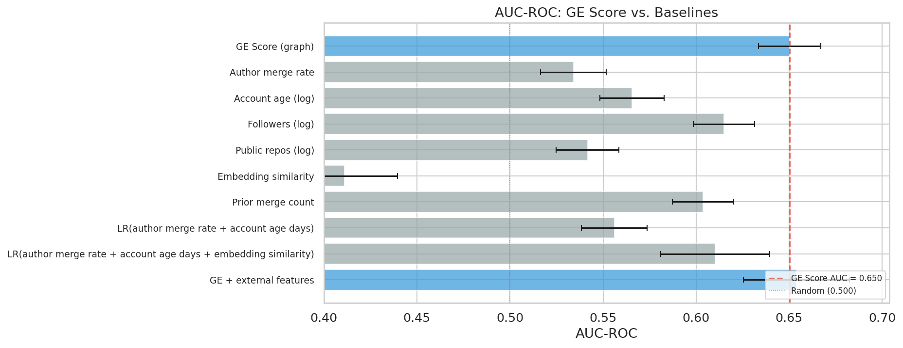

# GE Validation Study: Summary Report

**Date:** 2026-02-18 (post-V4-audit re-run)
**Branch:** `experiments/ge-validation`
**Sample:** 5,417 PRs across 49 repositories, 12 languages
**Temporal scope:** 2024-01-01 to 2025-12-31 (four half-year bins)
**Base rate:** 71.5% merged (3,874 / 5,417)

---

## Overview

This study evaluates whether the Good Egg (GE) normalized trust score---a
graph-based measure of contributor reputation computed from merged PR
history---predicts PR merge outcomes on open-source repositories. The study
uses a retrospective cohort design with an anti-lookahead constraint: each
author's score is computed using only contribution data available before the
test PR was opened.

The full design is documented in [`DOE.md`](../DOE.md). This report summarizes
results from the full-scale run across 49 repositories stratified by language,
size, and domain.

Three red team audits of the methodology and implementation were performed
([`RED_TEAM_AUDIT.md`](RED_TEAM_AUDIT.md)). The V1 audit found 13 issues
(3 critical, 4 major, 6 minor); the V2 audit found 7 additional issues
(1 critical, 2 major, 4 minor); the V4 audit (external review by @rlronan)
found 10 additional issues (0 critical, 6 major, 4 minor). All have been fixed.
See [Audit and Corrections](#audit-and-corrections) for details.

---

## Key Results

### H1: Binary Merge Discrimination (Primary)

**Result: Supported.** The GE score discriminates between merged and non-merged
PRs above the pre-registered threshold of AUC > 0.60.

| Metric | Value | Note |
|--------|-------|------|
| AUC-ROC | **0.650** (95% CI: 0.634--0.667) | Primary metric |
| AUC-PR | 0.782 | |
| Brier score | 0.263 | On uncalibrated scores; interpret with caution |
| Log loss | 4.987 | On uncalibrated scores; interpret with caution |

Brier score and log loss are computed on the raw GE normalized score, which is
not a calibrated probability. These values should not be compared to calibrated
baselines. AUC-ROC and AUC-PR are rank-based and unaffected by calibration.

The confidence interval [0.634, 0.667] excludes both chance (0.50) and the
pre-registered minimum threshold (0.60). Cross-validation confirms stability:
mean AUC = 0.649 +/- 0.044 across 5 folds (grouped by repository).

**Base rate context:** With a 71.5% merge rate, a naive classifier that always
predicts "merged" achieves 71.5% accuracy. At Youden's J optimal threshold
(0.642), the GE score achieves J = 0.276 with 68.0% accuracy (3,686 / 5,417),
which is *below* the naive baseline. This reflects the score's limited
discrimination: it improves true positive identification at the cost of false
positives that a naive classifier avoids.

The binary confusion matrix at Youden's J optimal threshold (0.642):

|  | Predicted Not-Merged | Predicted Merged |
|--|-----:|-----:|
| **Actual Not-Merged** | 831 | 712 |
| **Actual Merged** | 1,019 | 2,855 |

### H1a: Three-Class Discrimination (Merged vs. Rejected vs. Pocket Veto)

**Result: Supported.** GE scores differ significantly across all three outcome
classes.

| Test | Statistic | p-value |
|------|-----------|---------|
| Kruskal-Wallis | H = 352.4 | p < 10^-77 |
| Merged vs. Rejected (post-hoc) | U = 941,967 | p = 6.6 x 10^-6 (adjusted) |
| Merged vs. Pocket Veto (post-hoc) | U = 2,945,217 | p < 10^-76 (adjusted) |
| Rejected vs. Pocket Veto (post-hoc) | U = 293,184 | p < 10^-12 (adjusted) |

One-vs-rest AUC (how well the GE score separates each class from the other
two):

| Class | AUC-ROC | 95% CI |
|-------|---------|--------|
| Merged | 0.650 | 0.634--0.667 |
| Rejected | 0.472 | 0.443--0.501 |
| Pocket Veto | 0.325 | 0.307--0.344 |

The merged-vs-rest AUC mirrors H1. The pocket veto OVR AUC of 0.325
(equivalently, 0.675 when inverted) confirms low scores strongly predict
pocket veto outcomes. The rejected class is the hardest to separate (AUC near
0.50), consistent with rejected PRs occupying the middle of the score
distribution.

### Pocket Veto Analysis

Low-trust contributors are disproportionately pocket-vetoed rather than
explicitly rejected.

| Test | Statistic | p-value |
|------|-----------|---------|
| Chi-squared | chi2 = 67.3, df = 2 | p < 10^-15 |
| Cramer's V | 0.209 | (small-to-medium effect) |
| Cochran-Armitage trend | z = -0.177 | p = 0.860 (not significant) |

The chi-squared test confirms a significant association between trust level and
outcome type among non-merged PRs (Cramer's V = 0.209, small-to-medium effect). However,
the Cochran-Armitage trend test is not significant (p = 0.860), indicating the
relationship between trust level and pocket veto rate is not monotonically
linear --- the effect is concentrated in the LOW vs. MEDIUM/HIGH contrast
rather than a smooth gradient.

Trust-level odds ratios for merge outcome:

| Comparison | Odds Ratio | 95% CI | p-value |
|------------|-----------|--------|---------|
| HIGH vs. LOW | 3.88 | 3.39--4.45 | p < 10^-85 |
| MEDIUM vs. LOW | 2.68 | 2.21--3.25 | p < 10^-23 |
| HIGH vs. MEDIUM | 1.45 | 1.21--1.74 | p = 7.2 x 10^-5 |

HIGH-trust authors are 3.9x more likely to have their PRs merged than
LOW-trust authors. The MEDIUM-to-LOW contrast is also strong (2.7x), while
HIGH-to-MEDIUM is smaller but still significant (1.4x).

### H2: Ablation Study (Internal Dimensions)

**Result: Partially supported.** Of the six scoring dimensions, only recency
decay shows a statistically significant independent contribution after
Holm-Bonferroni correction (applied to the 6 primary single-dimension
ablations per DOE Section 7.4).

| Variant | AUC | Delta | Adjusted p | Significant? |
|---------|-----|-------|-----------|:------------:|
| **Full model** | **0.650** | -- | -- | -- |
| no_recency | 0.551 | -0.099 | < 10^-59 | Yes |
| no_repo_quality | 0.648 | -0.003 | 0.015 | Yes |
| no_language_match | 0.652 | +0.002 | 0.038 | Yes |
| no_diversity_volume | 0.650 | +0.000 | 0.969 | No |
| no_language_norm | 0.650 | +0.000 | 0.969 | No |
| no_self_penalty | 0.650 | +0.000 | 0.969 | No |

Exploratory two-way interactions:

| Variant | AUC | Delta |
|---------|-----|-------|
| no_recency_no_quality | 0.546 | -0.104 |
| recursive_quality | 0.647 | -0.003 |
| no_lang_match_no_lang_norm | 0.652 | +0.002 |
| no_diversity_no_self_penalty | 0.650 | +0.000 |

Removing recency drops AUC by 0.099 (from 0.650 to 0.551), close to chance.
Repo quality now survives Holm-Bonferroni correction (adjusted p = 0.015), as
does language match (adjusted p = 0.038). The remaining dimensions have
negligible individual impact.

**Interpretation:** The GE graph's discriminative power comes almost entirely
from recency-weighted contribution history. The graph *structure* (language
match, diversity/volume, self-contribution penalty, language normalization)
adds no measurable value to merge prediction. This does not mean these
dimensions are useless for other purposes (e.g., interpretability, fairness),
but they do not improve the score's ability to predict merge outcomes.

*Self-penalty sub-study:* A [dedicated evaluation](self_penalty_evaluation/report.md)
tested the self-contribution penalty more aggressively by fully excluding
self-owned repos from the scoring graph (0.0x weight). Even this extreme
variant produced AUC = 0.670, indistinguishable from the full model (DeLong
p = 0.73). The penalty's null effect is not an artifact of insufficient
variation: 62% of authors have self-owned repos, and full exclusion changes
46% of scores (mean shift -0.019).

### H3--H5: External Features (Incremental Value Beyond GE Score)

These hypotheses test whether features *not captured by the GE graph* carry
additional predictive information. All three use likelihood ratio tests on
nested logistic regression models (base model: GE score alone; extended model:
GE score + candidate feature). All use `penalty=None` (unregularized) to
satisfy the chi-squared distributional assumption. All three survive
Bonferroni correction at alpha/3 = 0.017.

| Hypothesis | Feature | LR Statistic | p-value | n (valid) | Survives Bonferroni? |
|------------|---------|-------------|---------|-----------|:--------------------:|
| H3 | Account age (log) | 19.16 | 1.2 x 10^-5 | 5,417 | Yes |
| H4 | Embedding similarity | 35.20 | 3.0 x 10^-9 | 1,569 | Yes |
| H5 | Author merge rate | 51.5 | 7.2 x 10^-13 | 5,129 | Yes |

**H3 (Account age):** Log-transformed account age significantly improves
prediction (LR = 19.16, p = 1.2 x 10^-5, n = 5,417). Account age carries modest
incremental information beyond what the GE score captures.

**H4 (Embedding similarity):** Cosine similarity between PR body and repo
README embeddings significantly improves prediction (LR = 35.20, p = 3.0 x
10^-9, n = 1,569). Note the reduced sample size (1,569 of 5,417 PRs had valid
Gemini embeddings for both PR body and repo README).

*AUC inversion:* The standalone AUC for embedding similarity is 0.411 — below
0.5, meaning higher PR-README similarity is associated with *lower* merge
probability. This is consistent across every method tested in the follow-up
robustness analysis (Gemini, TF-IDF, MiniLM, Jaccard). The LRT detects that
similarity adds *information* to the prediction model; it does not require the
relationship to be positive. Possible explanations include boilerplate/template
PRs closely matching the README text, and merged PRs targeting specific
subsystems whose vocabulary diverges from the high-level README.

*Robustness analysis:* A [similarity method comparison
sub-study](similarity_comparison/comparison_report.md) tested whether the H4
finding depends on the choice of embedding model. On the Gemini subset
(n=1,569), 2 of 6 methods survive Holm-Bonferroni correction: Gemini (the
original) and Jaccard (a simple bag-of-words method, adj. p = 0.001). On the
full dataset (n=5,417) — where all PRs are included using title as fallback
text — all five non-Gemini methods are highly significant (all adj. p < 10^-8).
The finding is partially robust on the original subset and strongly robust when
sample size limitations are removed. See the
[comparison report](similarity_comparison/comparison_report.md) for details.

**H5 (Author merge rate):** Temporally-scoped merge rate significantly improves
prediction (LR = 51.5, p = 7.2 x 10^-13, n = 5,129). Merge rate carries
meaningful incremental information beyond the graph-based trust score, though
the effect is substantially smaller than originally reported.

*V2 audit correction:* H5 originally reported LR = 462.4 using lifetime
`merged_count / (merged_count + closed_count)` from the GitHub API, which
included PRs merged *after* the test PR was created (temporal leakage). An
initial fix using proportional estimation of prior closed count gave LR =
289.3. After backfilling exact closed PR timestamps via the GitHub GraphQL API,
the fully corrected LR = 51.5 --- an order of magnitude smaller than the
original, confirming that the leakage severely inflated the result. The merge
rate feature remains highly significant (p < 10^-12) but is no longer the
dominant signal it appeared to be.

**Interpreting H2 vs. H3--H5:** H2 tests whether the GE score's *internal
dimensions* (recency, repo quality, language match, etc.) independently
contribute. H3--H5 test whether *external features* (not in the GE graph) add
information *beyond* the GE score. Both can be true simultaneously: the graph
structure may add little beyond recency (H2), while external features may add
value on top of the GE score (H3--H5). The H2 result means the graph's
non-recency dimensions do not contribute measurably; the H3--H5 results show
that author merge rate, embedding similarity, and account age each carry
additional signal the graph misses.

### Baseline Comparisons

The baseline comparisons test whether simple features or "dumb" models achieve
comparable AUC to the full GE graph, addressing whether the graph machinery
adds value beyond arithmetic.

#### Single-Feature AUC Baselines

| Feature | AUC-ROC | 95% CI | vs. GE (DeLong p) |
|---------|---------|--------|:-----------------:|
| **GE Score (graph)** | **0.650** | 0.634--0.667 | -- |
| Prior merge count | 0.604 | 0.587--0.620 | < 10^-12 |
| Followers (log) | 0.615 | 0.598--0.631 | < 10^-3 |
| Account age (log) | 0.566 | 0.548--0.583 | < 10^-16 |
| Author merge rate | 0.534 | 0.516--0.552 | < 10^-21 |
| Public repos (log) | 0.542 | 0.525--0.559 | < 10^-27 |
| Embedding similarity | 0.411 | 0.382--0.440 | < 10^-26 |

Embedding similarity has a standalone AUC of 0.411 (below 0.5), meaning it is
an *inverted* predictor: higher PR-README similarity is associated with lower
merge probability. See the H4 section above for interpretation.

With proper temporal scoping, no single feature approaches the GE score's
AUC. Author merge rate (AUC = 0.534) is now clearly inferior to the GE graph
(DeLong p < 10^-21). Prior merge count (0.604) and follower count (0.615) are
the strongest individual baselines but still significantly below GE.

*Note on temporal leakage impact:* Before backfilling exact closed PR
timestamps, author merge rate appeared to achieve AUC = 0.661 (not
significantly different from GE). The corrected value of 0.546 demonstrates
that the previous "merge rate matches GE" finding was an artifact of temporal
leakage in the denominator.

#### Multi-Feature "Dumb Baseline" Models

| Model | Features | AUC (in-sample) | CV Mean +/- SD | vs. GE (DeLong p) |
|-------|----------|-----------------|---------------|:-----------------:|
| GE Score | graph trust score | 0.650 | 0.649 +/- 0.044 | -- |
| Model A | merge_rate + account_age | 0.556 | 0.551 +/- 0.017 | < 10^-19 |
| Model B | merge_rate + age + embedding | 0.610 | 0.597 +/- 0.036 | 0.415 |
| Combined | GE + merge_rate + age + emb | 0.654 | 0.622 +/- 0.037 | 0.026 |

The GE graph significantly outperforms the "dumb baseline" models. Model A
(merge_rate + account_age, AUC = 0.556) is far below GE (DeLong p < 10^-19).
The graph's complexity is justified: it captures contributor reputation signal
that simple features do not.

The combined model (GE + all external features, AUC = 0.654, CV mean = 0.622)
shows marginal improvement over GE alone (DeLong p = 0.026). Model B
(merge_rate + age + embedding, AUC = 0.610) is not significantly different from
GE (DeLong p = 0.415) on the embedding subset, but this is driven by small
sample size (n = 1,495). Merge rate and account age add statistically
significant information (per LRT) but produce limited ranking improvement
beyond the graph.

### Feature Importance

Logistic regression coefficients (unregularized) confirm that the GE
normalized score is the dominant predictor, with author-level features (public
repos, followers, account age) contributing less but non-trivial additional
information.

### Calibration

The calibration plot shows the GE score is over-confident in the low-to-mid
range (scores 0.2--0.5 correspond to higher actual merge rates than predicted)
and slightly under-confident at high scores. The GE score should not be
interpreted as a merge probability without Platt scaling or similar calibration.

---

## Newcomer Cohort

Authors with no prior merged PRs in the GE graph ("newcomers") receive a
score of 0 and cannot be discriminated by the trust score alone.

| Cohort | n | AUC-ROC | Merge Rate |
|--------|---|---------|------------|
| Newcomer (score = 0) | 767 | 0.500 | 67.8% |
| Established (score > 0) | 4,650 | 0.668 (CI: 0.649--0.687) | 72.1% |

Newcomers constitute 14.2% of the sample. Among established contributors, the
AUC improves to 0.668, confirming the GE score is most useful for authors who
already have some contribution history. Notably, newcomers have a 68% merge
rate --- higher than the overall non-merged rate --- suggesting that many
first-time contributors to a repo already have external histories that would
produce non-zero GE scores if their other contributions were visible.

---

## Cross-Validation

Stratified group 5-fold cross-validation (grouped by target repository):

| Fold | AUC-ROC |
|------|---------|
| 1 | 0.593 |
| 2 | 0.700 |
| 3 | 0.701 |
| 4 | 0.623 |
| 5 | 0.626 |
| **Mean +/- SD** | **0.649 +/- 0.044** |

Three of five folds exceed the 0.60 threshold. Fold 1 (0.593) falls just below,
likely reflecting a repository cluster with weaker signal. The increased
variance compared to the pre-audit run (SD 0.048 vs. 0.027) is expected given
the larger, more diverse sample that now includes still-open PRs and
fast-merged PRs.

---

## Sensitivity Analyses

### Temporal Completeness (2025H2 Exclusion)

The 2025H2 temporal bin (Jul--Dec 2025) may contain PRs with unresolved outcomes
due to proximity to the study execution date (2026-02-18). A sensitivity analysis
computes the primary AUC-ROC with and without 2025H2 PRs to demonstrate result
stability.

| Dataset | n | AUC-ROC | 95% CI |
|---------|---|---------|--------|
| All bins | 5,417 | 0.650 | 0.634--0.667 |
| Excluding 2025H2 | 4,025 | 0.675 | -- |

Excluding 2025H2 (n=1,392 PRs) raises AUC by 0.025 (from 0.650 to 0.675),
consistent with the most recent temporal bin introducing noise from unresolved
outcomes.

### Stale Threshold Robustness

The primary binary AUC-ROC (merged vs. not-merged) is invariant to stale
threshold choice because the merged/not-merged boundary depends on `merged_at`,
not the stale threshold. The stale threshold only affects the rejected/pocket-veto
split within the non-merged class (H1a three-class analysis).

This means the primary result (AUC-ROC = 0.650) is robust to any reasonable
threshold choice, including the previous 5x-median formula and the current
90th-percentile formula.

---

## Implications for Good Egg

1. **The GE score is a statistically significant but modest merge predictor.**
   AUC-ROC of 0.650 (95% CI [0.634, 0.667]) exceeds both chance and the
   pre-registered 0.60 threshold. However, at the optimal classification
   threshold (Youden's J), accuracy (68.0%) is below the naive "always predict
   merged" baseline (71.5%). The score provides ranking information, not
   accurate classification.

2. **The graph significantly outperforms simple features.** With proper
   temporal scoping, no single feature or simple feature combination matches
   the GE score. Author merge rate alone achieves AUC = 0.534; a two-feature
   model (merge_rate + account_age) achieves AUC = 0.556. The graph's
   recency-weighted contribution history captures reputation signal that
   simple features do not.

3. **Recency is the dominant scoring dimension.** Removing recency decay drops
   AUC by 0.099 to near chance. Repo quality and language match now survive
   Holm-Bonferroni correction (adjusted p = 0.015 and 0.038, respectively),
   but with very small effect sizes (delta < 0.003). The remaining non-recency
   graph dimensions (diversity/volume, self-contribution penalty, language
   normalization) do not contribute measurably to merge prediction.

4. **External features add incremental value beyond the GE score.** All three
   augmentation hypotheses are supported:
   - Author merge rate (LR = 51.5, p < 10^-12)
   - Embedding similarity (LR = 35.2, p = 3 x 10^-9) — note: inverted
     predictor (higher similarity → lower merge probability); a robustness
     sub-study confirms the signal generalizes across methods and to the full
     dataset (n=5,417)
   - Account age (LR = 19.2, p = 1.2 x 10^-5)

   A combined model (GE + externals, AUC = 0.654) shows marginal improvement
   (DeLong p = 0.026). Merge rate and account age add statistically significant
   information (per LRT) but produce limited ranking improvement beyond the
   graph.

5. **Pocket veto detection is a strong secondary use case.** LOW-trust authors
   are 3.9x less likely to have PRs merged than HIGH-trust authors. The
   association between trust and pocket veto is significant (chi2 p < 10^-15),
   though the relationship is a step function (LOW vs. rest) rather than a
   smooth gradient (Cochran-Armitage p = 0.860).

6. **Newcomer cold-start remains an open problem.** The score is uninformative
   for 14.2% of PRs from first-time contributors. Account age and embedding
   similarity carry incremental signal and could help in a newcomer-specific
   model even when the graph score is zero.

See [`BETTER_EGG.md`](BETTER_EGG.md) for a detailed analysis of what works,
what doesn't, and recommendations for an improved scoring approach.

---

## Audit and Corrections

Three red team audits ([`RED_TEAM_AUDIT.md`](RED_TEAM_AUDIT.md)) identified 30
total issues. All have been fixed and the pipeline fully re-run.

### V1 Audit (13 issues)

| Issue | Severity | Status |
|-------|----------|--------|
| LRTs used L2-regularized LR (H3/H4/H5) | Critical | Fixed (`penalty=None`); re-run confirmed H3/H4 now significant |
| H4 embeddings used repo names, not content | Critical | Fixed (Gemini `gemini-embedding-001` on PR bodies + repo READMEs) |
| Still-open PRs from study period not collected | Critical | Fixed; backfilled open PRs, sample grew from 3,005 to 4,977 |
| Brier/log loss on uncalibrated scores | Major | Caveat added; metrics retained for reference |
| Holm-Bonferroni on 10 tests instead of 6 | Major | Corrected to 6 primary ablations per DOE |
| Self-owned repo PRs not excluded | Major | Author-vs-owner check added in Stage 2 |
| Spam filter excluded fast merges | Major | Filter now only applies to non-merged PRs |
| 6 minor issues | Minor | All resolved (see RED_TEAM_AUDIT.md) |

### V2 Audit (7 issues)

| Issue | Severity | Status |
|-------|----------|--------|
| H5 merge rate has temporal leakage | Critical | Fixed; exact temporal scoping with backfilled closed PR data (LR: 462 -> 51.5) |
| No baseline comparison | Major | Fixed; 6 single-feature + 3 model baselines added |
| SUMMARY.md framing issues | Major | Fixed; this document rewritten |
| H3 imputes missing data as 0 | Minor | Fixed; valid mask added |
| `_is_merge_bot_close` checks wrong field | Minor | Fixed; author check removed |
| Multinomial LR and CV use L2 | Minor | Fixed; `penalty=None` |
| DOE embedding model mismatch | Minor | Fixed; DOE updated |

### V4 Audit (10 issues — external review by @rlronan)

| Issue | Severity | Status |
|-------|----------|--------|
| Pocket veto buffer creates hidden 4th state | Major | Fixed (buffer = 0); re-run complete |
| Stale threshold should use percentile | Major | Fixed (90th percentile); re-run complete |
| 2025H2 has incomplete data | Major | Fixed (sensitivity analysis added); re-run complete |
| No threshold sensitivity analysis | Major | Fixed (documented invariance) |
| DOE describes unimplemented oversampling | Major (DOE) | Fixed (paragraph removed) |
| DOE search qualifier wrong | Major (DOE) | Fixed (corrected to `created:`) |
| Anti-lookahead scope unclear | Minor | Fixed (DOE clarified) |
| Self-owned repo distinction unclear | Minor | Fixed (DOE clarified) |
| Star history limitation overstated | Minor | Fixed (DOE updated) |
| No component caching | Minor | Fixed (DOE updated) |

---

## Limitations

- **Survivorship bias**: GE scores are computed only from merged PRs. Authors
  with high rejection rates may appear more trustworthy than warranted. A
  [rejection awareness sub-study](rejection_awareness/report.md) tested two
  graph-integrated approaches (per-repo and author-level merge-rate
  scaling) but found no statistically significant improvement over the full model
  (all DeLong p > 0.45). Graph-integrated rejection awareness does not improve
  AUC in this dataset.
- **Repository metadata currency**: Star counts and archive status are fetched
  at query time, not at PR creation time.
- **Rejected-class contamination**: The "rejected" class includes superseded
  and author-abandoned PRs, which may attenuate effect sizes.
- **No causal claims**: The study evaluates predictive discrimination, not
  whether trust causes merges.
- **Closed PR coverage**: H5 merge rate uses exact temporal filtering for
  both merged and closed PRs. Closed PR timestamps were backfilled for 1,959
  authors (capped at 500 most recent per author). Authors with > 500 closed
  PRs may have incomplete historical data.

See [DOE.md, Section 9](../DOE.md#9-known-limitations-and-threats-to-validity)
for the full limitations discussion.

---

## Appendix: Raw Data

- Statistical test results: [`statistical_tests.json`](statistical_tests.json)
- Red team audit: [`RED_TEAM_AUDIT.md`](RED_TEAM_AUDIT.md)
- Better Egg analysis: [`BETTER_EGG.md`](BETTER_EGG.md)
- Similarity method comparison: [`similarity_comparison/`](similarity_comparison/)
  ([report](similarity_comparison/comparison_report.md),
  [audit](similarity_comparison/RED_TEAM_AUDIT.md),
  [results](similarity_comparison/results.json))
- Self-penalty evaluation: [`self_penalty_evaluation/`](self_penalty_evaluation/)
  ([report](self_penalty_evaluation/report.md),
  [results](self_penalty_evaluation/results.json))
- Rejection awareness evaluation: [`rejection_awareness/`](rejection_awareness/)
  ([report](rejection_awareness/report.md),
  [results](rejection_awareness/results.json))
- Figures directory: [`figures/`](figures/)
- Study design: [`DOE.md`](../DOE.md)
- Study configuration: [`study_config.yaml`](../study_config.yaml)
- Repository list: [`repo_list_full.yaml`](../repo_list_full.yaml)
